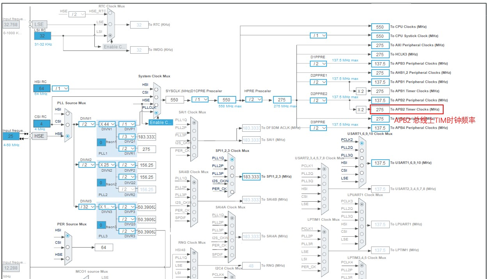

# Chapter1 快速上手

## 1. 运行流程


# Chapter2 CubeMX 配置指南

## 1. 旋转变压器(AD2S1210)配置

### GPIO 配置

GPIO 参考配置如下：

- 驱动电机旋转变压器：

    | 引脚       | 默认输出电平(GPIO output level) | GPIO模式(GPIO mode) | 上拉/下拉(GPIO Pull-up/Pull down) | 输出速率(Maxumum output speed) | 旋变引脚    |
    | ---------- | ------------------------------- | ------------------- | --------------------------------- | ------------------------------ | ----------- |
    | PA11       | High                            | Output Push Pull    | Pull-up                           | High                           | AD2S1_PCS   |
    | PA15(JTDI) | Low                             | Output Push Pull    | Pull-up                           | Low                            | AD2S1_A0    |
    | PB2        | High                            | Output Push Pull    | Pull-up                           | Low                            | AD2S1_RD    |
    | PB6        | Low                             | Output Push Pull    | Pull-up                           | Low                            | AD2S1_DIR   |
    | PB7        | High                            | Output Push Pull    | Pull-up                           | High                           | SPI1_CS     |
    | PB9        | Low                             | Output Push Pull    | Pull-up                           | Low                            | AD2S1_A1    |
    | PF0        | Low                             | Output Push Pull    | Pull-up                           | High                           | AD2S1_SAM   |
    | PF1        | High                            | Output Push Pull    | Pull-up                           | Low                            | AD2S1_RESET |

- 负载电机旋转变压器：

  | 引脚  | 默认输出电平(GPIO output level) | GPIO模式(GPIO mode) | 上拉/下拉(GPIO Pull-up/Pull down) | 输出速率(Maxumum output speed) | 旋变引脚    |
  | ----- | ------------------------------- | ------------------- | --------------------------------- | ------------------------------ | ----------- |
  | PB10  | High                            | Output Push Pull    | Pull-up                           | Low                            | AD2S2_PCS   |
  | PB12  | Low                             | Output Push Pull    | Pull-up                           | Low                            | AD2S2_A0    |
  | PC2_C | Low                             | Output Push Pull    | Pull-up                           | Low                            | AD2S2_SAM   |
  | PC3_C | High                            | Output Push Pull    | Pull-up                           | Low                            | AD2S2_RESET |
  | PC13  | High                            | Output Push Pull    | Pull-up                           | Low                            | AD2S2_RD    |
  | PE0   | Low                             | Output Push Pull    | Pull-up                           | Low                            | AD2S2_DIR   |
  | PE1   | High                            | Output Push Pull    | Pull-up                           | Low                            | SPI2_CS     |
  | PE4   | Low                             | Output Push Pull    | Pull-up                           | Low                            | AD2S2_A1    |

### SPI 配置

SPI 参考配置如下，一般配置 SPI 波特率在 25 MBits/s 以下：


SPI 的引脚：

| 引脚               | SPI引脚   |
| ------------------ | --------- |
| PB3(JTDO/TRACESWO) | SPI1_SCK  |
| PB4(NJTRST)        | SPI1_MISO |
| PB5                | SPI1_MOSI |
| PB13               | SPI2_SCK  |
| PB14               | SPI2_MISO |
| PB15               | SPI2_MOSI |

## 2. 逆变器配置

### TIM 配置

#### 引脚分配

TIM1 负责负载电机的逆变器控制，TIM8 负责驱动电机的逆变器控制。TIM 的引脚分配如下：

| 引脚 | TIM引脚   |
| ---- | --------- |
| PA7  | TIM8_CH1N |
| PB0  | TIM8_CH2N |
| PB1  | TIM8_CH3N |
| PC6  | TIM8_CH1  |
| PC7  | TIM8_CH2  |
| PC8  | TIM8_CH3  |
| PE8  | TIM1_CH1N |
| PE9  | TIM1_CH1  |
| PE10 | TIM1_CH2N |
| PE11 | TIM1_CH2  |
| PE12 | TIM1_CH3N |
| PE13 | TIM1_CH3  |

CHx 对应逆变器上桥臂，CHxN 对应逆变器下桥臂。

对应的 TIM 配置如下：


#### 时基单元配置

在时钟树中可以看到 TIM1 和 TIM8 的输入频率均为 275MHz(TIM1 和 TIM8 在 APB2 总线上)：



时基单元配置如下：


> 1. 定时器单次计数频率：
>    $$
>    f_{TIM} = \frac{f_{APB}}{PSC+1} = \frac{275MHz}{11} = 25MHz
>    $$
>
> 2. 由于使用中心对齐模式，PWM 载波波形如下：
>
>    
>
>    载波频率(逆变器开关频率)：
>    $$
>    f_s = \frac{f_{TIM}}{2 \times ARR} = \frac{25MHz}{2 \times 1250} = 10kHz
>    $$
>
> 3. 配置重复计数器 RCR 为 1，此时 TIM 定时器更新事件/更新中断在下图所示的地方产生：
>
>    

#### 死区配置


死区时间：
$$
T_s = Dead\_Time \times \frac{1}{f_{TIM}} = 50 \times \frac{1}{275MHz} = 181ns
$$

#### PWM 输出配置


此时的 PWM 波形(逆变器上桥臂开关信号)如下：


#### ADC 触发信号配置

##### 配置模式1

使用 PWM 通道 4 形成 TRGO2 触发信号。


##### 配置模式2


## 3. 采样配置

 ### 引脚分配

| 引脚 | ADC引脚    | 用途        |
| ---- | ---------- | ----------- |
| PA2  | ADC1_INP14 | 负载电机U相 |
| PA3  | ADC1_INP15 | 负载电机V相 |
| PC4  | ADC1_INP4  | 驱动电机V相 |
| PC5  | ADC1_INP8  | 驱动电机U相 |

### ADC基础配置


### 注入组配置

ADC 的注入组可以使用采用事件触发机制，且优先级最高，适合进行电流采样。


- 配置模式1

  ADC 的触发事件可以为 `Capture Compare 4 event`：

  

- 配置模式2

  

采样完成后会触发注入组采样中断，在 CubeMX 里面使能中断：


# Chapter3 用户代码编写指南

## 1. 代码结构


### 初始化程序

```c
/**
 * @brief   Init Program
 */
static void init(void)
{
    // User init
    user_init();
    // Hardware init
    hw_init();
}
```


### 电流采样中断程序

```c
/**
 * @brief   ADC Injected Channel interrupt Callback function
 */
void HAL_ADCEx_InjectedConvCpltCallback(ADC_HandleTypeDef *hadc)
{
    HAL_GPIO_WritePin(GPIOF, GPIO_PIN_4, 0); // Caculate running time

    /**********************************
     * @brief   Sample Calculate
     */
    hw_curr_sample(hadc);

    // Angle and Speed Sample
    AD2S1210_Angle_Get();                   // Angle Sample
    AD2S1210_Speed_Get(SYSTEM_SAMPLE_TIME); // Speed Sample
    /**********************************
     * @brief   FOC Calculate
     */
    drive_foc_calc();
    load_foc_calc();

    /**********************************
     * @brief   Voltage-Source Inverter Control
     */
    if (system_enable == 0) {
        TIM8->CCR1 = 0;
        TIM8->CCR2 = 0;
        TIM8->CCR3 = 0;
        TIM1->CCR1 = 0;
        TIM1->CCR2 = 0;
        TIM1->CCR3 = 0;
    } else {
        TIM8->CCR1 = Drive_duty_abc.dutya * TIM8->ARR;
        TIM8->CCR2 = Drive_duty_abc.dutyb * TIM8->ARR;
        TIM8->CCR3 = Drive_duty_abc.dutyc * TIM8->ARR;
        TIM1->CCR1 = Load_duty_abc.dutya * TIM1->ARR;
        TIM1->CCR2 = Load_duty_abc.dutyb * TIM1->ARR;
        TIM1->CCR3 = Load_duty_abc.dutyc * TIM1->ARR;
    }

    /**********************************
     * @brief   DAC Output
     */
    hw_dac_output();
    HAL_DAC_SetValue(&hdac1, DAC_CHANNEL_1, DAC_ALIGN_12B_R, system_dac_value1);
    HAL_DAC_SetValue(&hdac1, DAC_CHANNEL_2, DAC_ALIGN_12B_R, system_dac_value2);

    HAL_GPIO_WritePin(GPIOF, GPIO_PIN_4, 1); // Caculate running time
}
```


**用户可以改写驱动电机的 FOC 代码(增加无感算法)**。`drive_foc_calc()` 函数运行逻辑如下：


用户也可以改写负载电机的 FOC 代码以提供多种工作模态。

> 不同配置下的采样-更新时序：
>
> - 配置模式1
>
>   
>
> - 配置模式2
>  

## 2. 用户编写代码

用户应当在 `userpara.c`/`userpara.h`，`drivefoc.c`/`drivefoc.h`，`userinit.c`/`userinit.h` 三组文件中编写用户自定义代码。

### `userpara.c/h` 文件

该文件进行全局变量定义，将全局变量单独列出一个文件以便于调试时观察变量。

### `userinit.c/h` 文件

该文件内是用户代码参数初始化函数 `user_init()`。

用户在该函数内编写代码以便进行算法参数初始化。

### `user_transfunc.c/h` 文件

该文件编写离散传递函数的实现(控制单元)。

### `drivefoc.c/h` 文件

该文件内是用于进行驱动电机 FOC 算法的函数 `drive_foc_calc()`。

用户在该函数内编写**针对驱动电机的无感算法**。

### `loadfoc.c/h` 文件

该文件内是用于进行负载电机 FOC 算法的函数 `load_foc_calc()`。

用户在该函数内编写针对于负载电机的控制算法。


